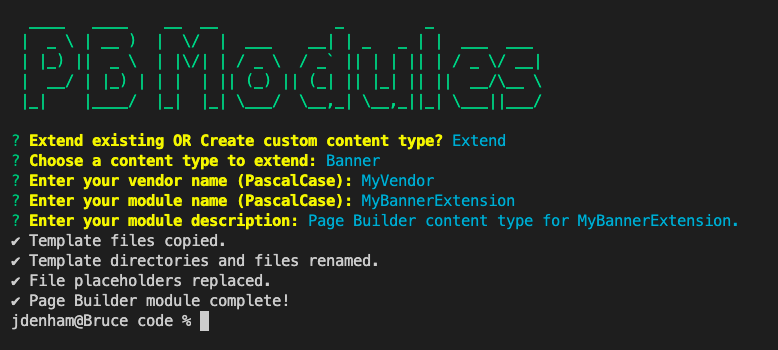
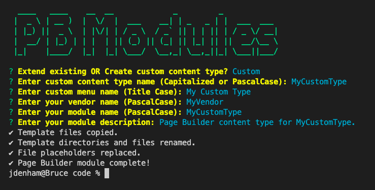

# CLI for scaffolding Page Builder modules

`pbmodules` is a CLI for scaffolding both custom and extension modules for Page Builder content types.

## Usage
1. Clone or download this repo.
1. CD into the `pbmodules` directory and run `npm install` to download package dependencies.
1. Run `npm install -g pbmodules` to install the scaffolding CLI globally.
1. Navigate to where you want to create your Page Builder module.
1. Enter `pbmodules` at the command prompt and follow the instructions.

## Examples

Two examples of using `pbmodules` are shown here. The first example shows extending a Page Builder Banner. The second shows creating a new custom content type:

_Example Banner extension module_

_Example custom content type module_

