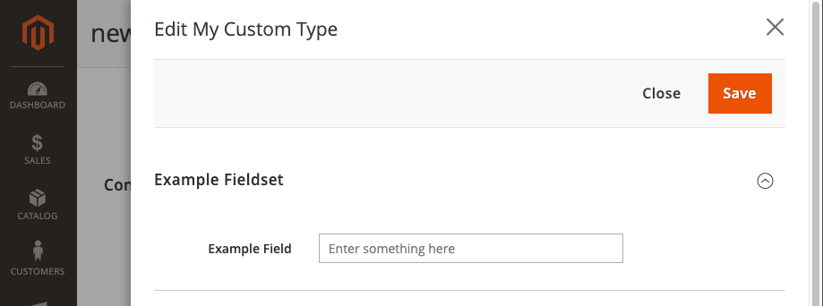

# Scaffolding CLI for Page Builder modules

`pbmodules` is a scaffolding CLI for creating both custom and extension starter modules for Page Builder content types.

## Usage

Navigate to your `<magento-instance-root>/app/code/` directory and run the following command:

```bash
npx https://github.com/magento-devdocs/pbmodules.git
```

## Scaffolding extension modules

To create a starter module for _extending_ a content type, select the **Extend** option from the first question and follow the instructions.

- **Choose a Page Builder content type to extend**: You can choose from a list of Page Builder's native content types, including, `column-groups`, `button-items`, and `tab-items`, and `slide`.

- **Enter your vendor name**: The vendor name is usually and abbreviated company name that serves as a namespace for your module and content type. It should be one word, a capitalized abbreviation. If it must be more than one word, use PascalCase.

- **Enter your module name**: The module name should also be one word (if possible) and capitalized. If it must be more than one word, use PascalCase. The module name should identify the Page Builder content type you are extending.

- **Enter your module description**: This is optional, but a simple default is provided. The module description is only used in the module's `composer.json`, which can be changed easily enough.

### Extended content type example
This example shows how to create a Page Builder starter module that extends the Page Builder Banner. It also shows the directories and files created.


## Scaffolding custom modules

To create a starter module for creating a _custom content type_, select the **Custom** option from the first question and follow the instructions.

- **Enter custom name**: This is name for your custom content type name. It should be capitalized and only one word if possible. If you need to use two words, use PascalCase to name it.

- **Enter custom menu name**: The menu name is the name you want displayed for your content type within the Page Builder panel on the left side of the page. This name should be one or two words max (if possible) so that the name isn't cropped when displayed.

- **Enter your vendor name**: The vendor name is usually and abbreviated company name that serves as a namespace for your module and content type. It should be one word, a capitalized abbreviation. If it must be more than one word, use PascalCase.

- **Enter your module name**: The module name should also be one word (if possible) and capitalized. If it must be more than one word, use PascalCase. The module name should identify the Page Builder content type in some way.

- **Enter your module description**: This is optional, but a simple default is provided. The module description is only used in the module's `composer.json`, which can be changed easily enough.

### Custom content type example

This example shows how to create a custom Page Builder starter module using the defaults. It also shows the directories and files created.


## Installing the starter modules

As with all Magento modules, to install your starter module:

1. Add your vendor-module directory to the `app/code/` directory of your Magento installation.
2. Navigate to your magento root directory, and run:

   ```bash
   bin/magento setup:upgrade
   ```

## After installation

After installing your custom content type starter module, your Page Builder panel should look something like this:


By default, the scaffolding CLI adds your custom module to the **Layout** section of the panel. You can move your content type to a different section of the panel by editing the `menu_section` of your configuration file, replacing `layout` with `elements`, `media`, or `add_content` (or your own section):

```xml
<type name="myvendor_mycontenttype"
          label="My Content Type"
          menu_section="layout"
          ...
          >
```

The custom content type starter module comes with a simple form input field that shows how bindings connect the form to the configuration and finally to the template. This field is meant for teaching purposes only and can be removed as needed. The default field looks like this:



## Feedback
We encourage and welcome you to help us improve this tool by submitting pull requests and issues.  We also welcome your feedback and ideas on other Page Builder tools and resources that would help improve your Page Builder development experience.

## Slack
You can join our #pagebuilder channel, within magentocommeng.slack.com, to post your questions to the Page Builder community.
